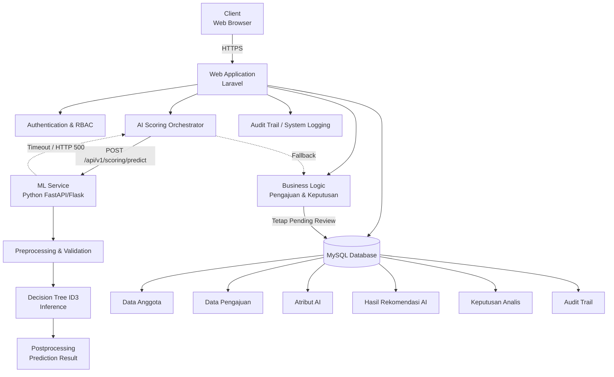
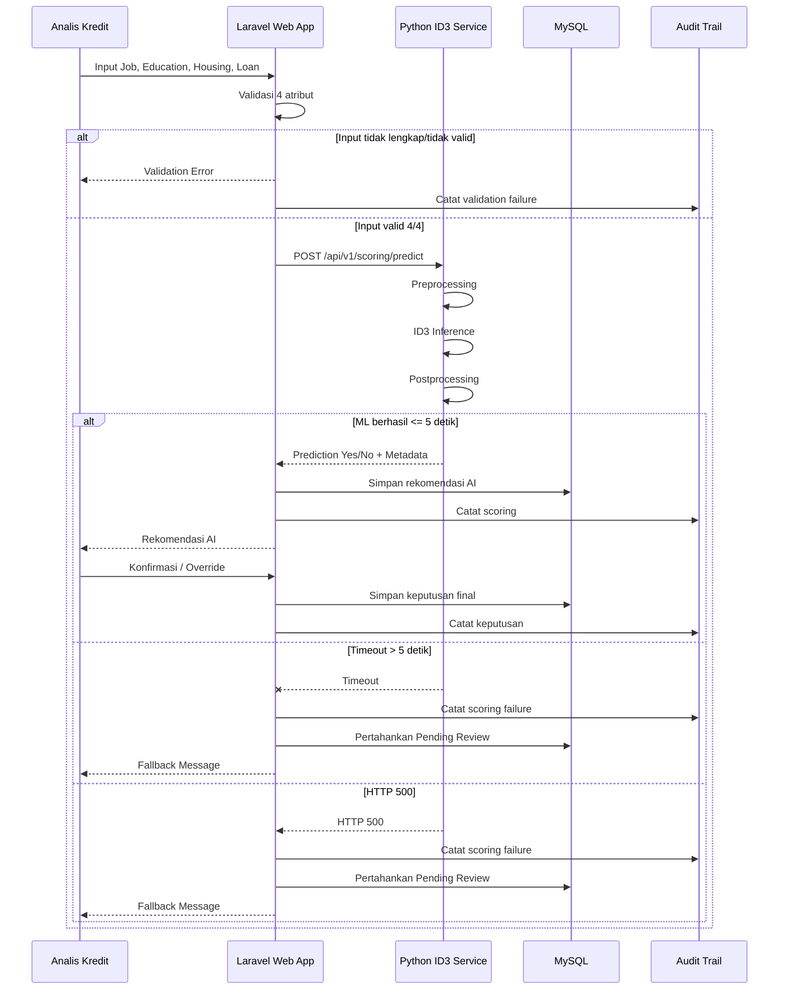

Berikut DRAF HLD yang menjaga batas antara **arsitektur tingkat tinggi (HLD)** dan **Low-Level Design (LLD)**. Komponen dan alur di bawah hanya diturunkan dari FR-01 s.d. FR-15, NFR, BR, serta stack yang diberikan.

# HIGH-LEVEL DESIGN (HLD)

## Sistem Informasi Koperasi Simpan Pinjam Berbasis AI

### Automatic Credit Scoring Engine — Decision Tree (ID3)

**Status:** Draft
**Arsitektur:** Web Application + Python ML Service
**Target:** Prototype 1 Semester / ±3 Bulan
**Model AI:** Decision Tree ID3
**Database:** MySQL
**AI Role:** Decision-Support Tool

---

# 1. DIAGRAM ARSITEKTUR SISTEM

## 1.1 High-Level Architecture



## 1.2 Prinsip Arsitektur

Arsitektur menggunakan pola **modular service-oriented sederhana**, dengan Laravel sebagai pusat business logic dan Python sebagai service khusus machine learning.

Prinsip utama:

1. **Laravel sebagai system of record dan business authority**

   * Mengelola autentikasi.
   * Mengelola RBAC.
   * Mengelola anggota dan pengajuan.
   * Mengelola keputusan final.
   * Mengelola persistence ke MySQL.

2. **Python sebagai ML execution service**

   * Hanya bertanggung jawab terhadap preprocessing yang diperlukan model dan inference ID3.
   * Tidak memiliki kewenangan menetapkan keputusan kredit final.

3. **MySQL sebagai persistent data store**

   * Menyimpan data operasional, hasil rekomendasi AI, keputusan analis, dan audit trail.

4. **Human-in-the-loop**

   * Hasil AI hanya menjadi rekomendasi.
   * Keputusan final selalu berasal dari Analis Kredit.

5. **Fail-safe**

   * Kegagalan ML tidak boleh mengubah pengajuan menjadi Diterima/Ditolak secara otomatis.

---

# 2. DESKRIPSI KOMPONEN & ARSITEKTUR

## 2.1 Komponen Utama

| Komponen                              | Peran dan Tanggung Jawab                                                                                          | Batasan                                               |
| ------------------------------------- | ----------------------------------------------------------------------------------------------------------------- | ----------------------------------------------------- |
| **Client / Web Browser**              | Menyediakan UI untuk Anggota, Admin, Analis Kredit, Manajemen, dan Auditor sesuai hak akses                       | Tidak menjalankan business decision atau inference AI |
| **Web Application Backend — Laravel** | Authentication, RBAC, anggota, pengajuan, business logic, orkestrasi scoring, keputusan analis, status, reporting | Menjadi otoritas keputusan bisnis                     |
| **AI Scoring Orchestrator**           | Memvalidasi kelengkapan input, mengirim request ke ML Service, menerima response, menangani timeout/error         | Tidak boleh mengubah keputusan final secara otomatis  |
| **ML Service — Python FastAPI/Flask** | Menjalankan preprocessing yang diperlukan dan inference Decision Tree ID3                                         | Tidak menentukan keputusan final manusia              |
| **Decision Tree ID3 Model**           | Menghasilkan klasifikasi `Yes` atau `No` berdasarkan empat atribut input                                          | Hanya menghasilkan rekomendasi model                  |
| **MySQL Database**                    | Persistence data anggota, pengajuan, atribut AI, hasil scoring, keputusan, dan audit trail                        | Akses melalui backend yang berwenang                  |
| **Audit Trail / System Logging**      | Mencatat aktivitas penting, scoring, keputusan, override, dan kegagalan proses                                    | Tidak digunakan sebagai pengambil keputusan           |

### [ASUMSI-HLD-01]

Audit Trail dapat diimplementasikan sebagai **modul/service logging pada Laravel** yang menyimpan record ke MySQL. Untuk prototype 3 bulan, belum diperlukan sistem observability/logging terdistribusi terpisah.

---

# 2.2 Pembagian Tanggung Jawab

```text
WEB BROWSER
    │
    │ User Interaction
    ▼
LARAVEL APPLICATION
    │
    ├── Authentication & RBAC
    ├── Member Management
    ├── Loan Application
    ├── Loan Status
    ├── AI Scoring Orchestration
    ├── Analyst Decision
    ├── Reporting
    └── Audit Trail
            │
            ├──────────────► MySQL
            │
            └──────────────► Python ML Service
                                  │
                                  └── Decision Tree ID3
```

Pembagian tersebut mencegah Python ML Service mengambil alih business logic. **Laravel menentukan apakah sebuah rekomendasi dapat digunakan dalam workflow keputusan, sedangkan Python hanya menyediakan hasil inference.**

---

# 2.3 Trade-Off Arsitektur Fitur AI

| Kriteria                | Cloud / External AI API                      | Dedicated Python ML Service                        | Embedded Engine / In-App Rules                            |
| ----------------------- | -------------------------------------------- | -------------------------------------------------- | --------------------------------------------------------- |
| **Akurasi**             | Bergantung pada model/API eksternal          | **Sesuai model ID3 yang dikembangkan dan diuji**   | Dapat sesuai model jika implementasi benar                |
| **Latensi**             | Bergantung koneksi dan provider              | **Dapat dikontrol; target ≤5 detik**               | Potensial sangat rendah                                   |
| **Biaya**               | Berpotensi memiliki biaya API dan penggunaan | **Rendah; dapat dijalankan pada resource minimal** | Rendah                                                    |
| **Privasi Data**        | Data perlu dikirim ke layanan eksternal      | **Data tetap berada pada infrastruktur sistem**    | **Data tetap berada pada aplikasi**                       |
| **Effort Pengembangan** | Relatif rendah untuk integrasi               | Sedang                                             | Sedang–tinggi jika model ML harus diintegrasikan langsung |
| **Kontrol Model**       | Terbatas pada provider                       | **Tinggi**                                         | Tinggi                                                    |
| **Pemeliharaan**        | Bergantung provider                          | **Terpisah dari aplikasi utama**                   | Model dan aplikasi lebih tightly coupled                  |

### Keputusan Arsitektur

**Arsitektur terpilih: Dedicated Python ML Service.**

Alasannya, pemisahan Python ML Service memberikan keseimbangan antara **kontrol model, privasi data, biaya rendah, dan kemudahan pengembangan** untuk prototype satu semester. Service juga memungkinkan model ID3 dikembangkan dan diuji tanpa mencampurkan dependensi machine learning secara langsung ke Laravel.

### Alternatif yang Dipertimbangkan

* **Cloud/External API:** tidak dipilih karena prototype tidak membutuhkan model eksternal dan terdapat pertimbangan privasi data anggota.
* **Embedded Engine:** secara teknis memungkinkan, tetapi meningkatkan coupling antara aplikasi Laravel dan komponen ML.

---

# 3. ALIRAN DATA END-TO-END FITUR AI

## 3.1 Data Flow



---

## 3.2 Tahapan Data Processing

### Tahap 1 — Input

Analis Kredit memasukkan empat atribut mandatory:

```text
Job
Education
Housing
Loan
```

Ketentuan:

* `Job` → nilai nominal yang sesuai domain data model.
* `Education` → nilai nominal yang sesuai domain data model.
* `Housing` → `Yes` / `No`.
* `Loan` → `Yes` / `No`.

### Tahap 2 — Preprocessing & Validation

Laravel melakukan validasi awal:

```text
4/4 atribut tersedia?
        │
        ├── Tidak → Validation Error
        │           Tidak ada request ML
        │
        └── Ya → Kirim ke ML Service
```

ML Service kemudian melakukan validasi/preprocessing yang diperlukan oleh model.

### Tahap 3 — Inference

Python ML Service menjalankan:

```text
Input
  ↓
Decision Tree ID3
  ↓
Prediction
```

Output model:

```text
Yes
atau
No
```

### Tahap 4 — Postprocessing

Laravel menerjemahkan hasil model menjadi informasi yang dapat dipahami pengguna:

```text
Yes → Rekomendasi AI: Diterima
No  → Rekomendasi AI: Ditolak
```

**Rekomendasi tersebut tidak langsung menjadi keputusan final.**

### Tahap 5 — Persistence

Laravel menyimpan sekurang-kurangnya:

```text
Atribut AI
    ↓
Hasil/Rekomendasi AI
    ↓
Keputusan Final Analis
    ↓
Status Pengajuan
```

Rekomendasi AI dan keputusan analis harus dapat dibedakan.

---

# 3.3 Fallback Path

Fallback berlaku apabila:

1. ML Service mengalami timeout **> 5 detik**; atau
2. ML Service mengembalikan **HTTP 500 Internal Server Error**; atau
3. [ASUMSI-HLD-02] terjadi kegagalan komunikasi yang menyebabkan response scoring tidak dapat diverifikasi.

Alurnya:

```text
ML Request
    │
    ▼
ML Service
    │
    ├── Success <= 5 detik
    │       ↓
    │   Prediction
    │
    └── Timeout / HTTP 500
            ↓
       Exception Handling
            ↓
       Audit / Logging
            ↓
       Status = Pending Review
            ↓
       Fallback Message
```

Pesan fallback:

> **"Proses scoring AI mengalami batas waktu/gagal."**

Kondisi yang **dilarang**:

```text
ML Timeout
   ↓
❌ Diterima otomatis

ML HTTP 500
   ↓
❌ Ditolak otomatis
```

Keduanya harus berakhir pada:

```text
Status = Pending Review
```

---

# 4. KONTRAK ANTARKOMPONEN

## 4.1 Endpoint Utama

**Endpoint:**

```http
POST /api/v1/scoring/predict
```

**Tujuan:** meminta Credit Scoring Engine menghasilkan rekomendasi berdasarkan empat atribut mandatory.

---

## 4.2 Request Payload

Contoh struktur tingkat tinggi:

```json
{
  "job": "private",
  "education": "secondary",
  "housing": "yes",
  "loan": "no"
}
```

### Aturan Request

| Field       | Mandatory | Tipe Konseptual | Validasi           |
| ----------- | --------: | --------------- | ------------------ |
| `job`       |        Ya | Nominal/String  | Tidak boleh kosong |
| `education` |        Ya | Nominal/String  | Tidak boleh kosong |
| `housing`   |        Ya | Enum            | `yes` / `no`       |
| `loan`      |        Ya | Enum            | `yes` / `no`       |

**Catatan:** representasi nilai nominal pada contoh di atas bersifat ilustratif. Mapping kategori final harus mengikuti dataset/model yang benar-benar digunakan.

---

## 4.3 Response Success

Contoh kontrak tingkat tinggi:

```json
{
  "success": true,
  "prediction": "Yes",
  "recommendation": "Diterima",
  "processing_time_ms": 125,
  "model": {
    "name": "Decision Tree",
    "algorithm": "ID3",
    "version": "1.0"
  }
}
```

Field utama:

| Field                | Fungsi                      |
| -------------------- | --------------------------- |
| `success`            | Menunjukkan proses berhasil |
| `prediction`         | Hasil klasifikasi model     |
| `recommendation`     | Interpretasi hasil untuk UI |
| `processing_time_ms` | Waktu pemrosesan scoring    |
| `model.name`         | Nama model                  |
| `model.algorithm`    | Algoritma                   |
| `model.version`      | Identitas versi model       |

---

## 4.4 Response Validation Error

```json
{
  "success": false,
  "error": {
    "code": "VALIDATION_ERROR",
    "message": "Atribut Loan wajib diisi"
  }
}
```

HTTP status yang direkomendasikan:

```http
HTTP 422 Unprocessable Entity
```

---

## 4.5 Response Service Error

```json
{
  "success": false,
  "error": {
    "code": "SCORING_SERVICE_UNAVAILABLE",
    "message": "Proses scoring AI mengalami batas waktu/gagal"
  }
}
```

HTTP status dapat berupa:

```http
HTTP 500
```

atau status service-unavailable yang sesuai dengan mekanisme deployment.

**Catatan:** detail status HTTP final perlu ditetapkan pada API specification/LLD.

---

## 4.6 Timeout Contract

Laravel harus memiliki batas waktu pemanggilan ML Service yang konsisten dengan SLA:

```text
Request Scoring
      ↓
Maximum AI Processing SLA = 5 detik
      ↓
Response valid?
   ├── Ya → Simpan hasil rekomendasi
   └── Tidak → Fallback
                  ↓
             Pending Review
```

### [ASUMSI-HLD-03]

Nilai timeout teknis HTTP dapat dibuat sedikit lebih besar atau disesuaikan dengan overhead komunikasi, tetapi **business SLA untuk pemrosesan scoring tetap ≤5 detik**. Nilai timeout koneksi/read timeout final ditetapkan pada konfigurasi deployment.

---

# 5. SECURITY & PRIVACY BY DESIGN

## 5.1 Authentication

Seluruh fungsi yang membutuhkan identitas pengguna harus berada di balik mekanisme authentication.

```text
User
 ↓
Login
 ↓
Authentication
 ↓
Session/Token
 ↓
RBAC
 ↓
Authorized Module
```

---

## 5.2 Role-Based Access Control

Role utama:

| Role              | Akses Utama                                                      |
| ----------------- | ---------------------------------------------------------------- |
| **Anggota**       | Pengajuan sendiri dan tracking status sendiri                    |
| **Admin**         | Manajemen anggota dan akses pengajuan sesuai kewenangan          |
| **Analis Kredit** | Penilaian AI, review pengajuan, keputusan dan override           |
| **Manajemen**     | Akses sesuai kewenangan terhadap informasi/laporan yang tersedia |
| **Auditor**       | Akses terhadap informasi audit sesuai kewenangan                 |

Hak akses tidak hanya ditentukan berdasarkan UI, tetapi harus divalidasi pada **backend authorization layer**.

---

# 5.3 Isolasi Data Anggota

Sesuai **BR-03**, Anggota hanya dapat mengakses pengajuan miliknya sendiri.

```text
Anggota A
   │
   ├── Pengajuan A → ✓ Allowed
   │
   └── Pengajuan B → ✗ Forbidden
```

Backend harus melakukan authorization sebelum mengembalikan data.

---

# 5.4 Encryption

Data sensitif anggota dan finansial dilindungi:

### Data in Transit

```text
Browser
   ↓ HTTPS/TLS
Laravel
   ↓ secure internal communication
Python ML Service
```

### Data at Rest

Database MySQL dan media penyimpanan harus menggunakan mekanisme perlindungan data yang sesuai lingkungan deployment.

### [ASUMSI-HLD-04]

Detail algoritma enkripsi field-level untuk data tertentu belum ditentukan oleh SRS sehingga tidak ditetapkan pada HLD. HLD menetapkan kebutuhan **confidentiality**, sedangkan algoritma dan key management menjadi bagian desain keamanan/LLD.

---

# 5.5 Audit Trail

Aktivitas kritis yang perlu dapat ditelusuri meliputi:

```text
User Login / Aktivitas Penting
        ↓
Input Scoring
        ↓
AI Recommendation
        ↓
Analyst Confirmation
        ↓
Analyst Override
        ↓
Status Change
        ↓
ML Failure
```

Prinsip penting:

```text
AI Recommendation ≠ Analyst Decision
```

Contoh:

```text
AI Recommendation : Ditolak
Analyst Decision   : Diterima
Decision Type      : Override
```

Informasi tersebut harus tetap dapat dibedakan untuk kebutuhan audit.

---

# 5.6 AI sebagai Decision-Support

Arsitektur menerapkan prinsip:

```text
                 ┌─────────────────────┐
                 │ Credit Scoring ID3  │
                 └──────────┬──────────┘
                            │
                            ▼
                   AI Recommendation
                     Yes / No
                            │
                            ▼
                 ┌─────────────────────┐
                 │    Analis Kredit    │
                 │ Review & Decision   │
                 └──────────┬──────────┘
                            │
                  ┌─────────┴─────────┐
                  ▼                   ▼
               Diterima             Ditolak
```

ML Service **tidak memiliki endpoint atau kewenangan untuk langsung menetapkan status final pengajuan**.

---

# 6. DEPLOYMENT ENVIRONMENT

## 6.1 Development

Digunakan untuk pengembangan dan pengujian developer.

```text
Developer Machine
├── Laravel Application
├── Python ML Service
└── MySQL
```

Untuk prototype, seluruh komponen dapat dijalankan pada satu mesin menggunakan container atau environment lokal.

---

## 6.2 Staging

Digunakan untuk integration testing, QA, dan UAT.

```text
Staging Server
├── Web Server
│    └── Laravel
├── Python ML Service
└── MySQL
```

Dataset dan konfigurasi staging harus dipisahkan dari data produksi.

---

## 6.3 Production

Untuk prototype dengan beban terbatas:

```text
Production Server
├── Laravel Application
├── Python ML Service
└── MySQL
```

Pemisahan service tetap dipertahankan meskipun secara fisik dapat berjalan pada satu server untuk menghemat biaya.

### [ASUMSI-HLD-05]

Prototype 1 semester belum membutuhkan Kubernetes, service mesh, multi-region deployment, atau arsitektur cloud multi-node karena kebutuhan komputasi dan skala sistem belum mensyaratkan kompleksitas tersebut.

---

# 6.4 Deployment Strategy yang Dipilih

| Aspek              | Keputusan HLD                                    |
| ------------------ | ------------------------------------------------ |
| Web Application    | Laravel                                          |
| ML Service         | Python FastAPI/Flask                             |
| Database           | MySQL                                            |
| Deployment awal    | Single server/VM dapat digunakan                 |
| Service separation | Laravel dan Python tetap dipisahkan secara logis |
| Communication      | HTTP/REST                                        |
| Transport          | HTTPS pada environment non-local                 |
| AI SLA             | ≤ 5 detik                                        |
| AI Failure         | Fallback → Pending Review                        |
| Scaling            | Belum diperlukan secara kompleks untuk prototype |
| Container          | Opsional                                         |
| Kubernetes         | Tidak diperlukan untuk prototype                 |

**Alasan:** deployment single-server atau VM dengan pemisahan service secara logis memberikan biaya operasional rendah sekaligus mempertahankan boundary antara aplikasi bisnis dan ML Service.

---

# 7. KOMPONEN ARSITEKTUR DAN TRACEABILITY

| Requirement Area | Komponen Utama          | Implementasi HLD                   |
| ---------------- | ----------------------- | ---------------------------------- |
| FR-01            | Laravel + MySQL         | Manajemen data anggota             |
| FR-02            | Laravel + MySQL         | Pengajuan pinjaman                 |
| FR-03            | Laravel + MySQL         | Daftar pengajuan                   |
| FR-04            | Laravel + MySQL         | Input dan persistence 4 atribut AI |
| FR-05            | Python ID3 Service      | Inference Decision Tree ID3        |
| FR-06            | Laravel ↔ Python        | REST API scoring                   |
| FR-07            | Laravel + Python        | Penyajian rekomendasi Yes/No       |
| FR-08            | Laravel + MySQL         | Penyajian atribut dasar scoring    |
| FR-09            | Laravel + MySQL         | Penyimpanan keputusan Analis       |
| FR-10            | Laravel + MySQL + Audit | Override AI                        |
| FR-11            | Laravel + MySQL         | Pembaruan status                   |
| FR-12            | Laravel + RBAC          | Tracking pengajuan Anggota         |
| FR-13            | Laravel + RBAC          | Daftar pengajuan Analis            |
| FR-14            | Audit Trail + MySQL     | Pencatatan aktivitas               |
| FR-15            | Laravel + MySQL         | Reporting                          |

---

# 8. KEPUTUSAN ARSITEKTUR UTAMA

### ADR-HLD-01 — Dedicated Python ML Service

**Keputusan:** Model ID3 dijalankan sebagai service Python terpisah.

**Alasan:** memberikan pemisahan tanggung jawab antara business application dan ML inference, serta memungkinkan pengembangan model menggunakan ekosistem Python tanpa memasukkan seluruh dependency ML ke Laravel.

### ADR-HLD-02 — Laravel sebagai Business Authority

**Keputusan:** Laravel menjadi otoritas untuk status dan keputusan final.

**Alasan:** AI hanya berperan sebagai decision-support. Dengan demikian, hasil `Yes/No` dari model tidak dapat secara langsung mengubah keputusan final tanpa tindakan Analis Kredit.

### ADR-HLD-03 — MySQL sebagai System of Record

**Keputusan:** data operasional dan hasil proses disimpan pada MySQL.

**Alasan:** kebutuhan prototype bersifat relational dan tidak membutuhkan database terdistribusi atau NoSQL.

### ADR-HLD-04 — Fail-Safe ML Integration

**Keputusan:** timeout/error ML menghasilkan fallback dan mempertahankan `Pending Review`.

**Alasan:** mencegah kegagalan service AI menghasilkan keputusan kredit otomatis yang tidak valid.

### ADR-HLD-05 — REST API untuk Integrasi Laravel–Python

**Keputusan:** Laravel berkomunikasi dengan ML Service melalui REST API.

**Alasan:** REST sederhana, mudah diuji, ringan, dan sesuai dengan kebutuhan integrasi dua service pada prototype tiga bulan.

---

# 9. BATASAN HLD

Dokumen ini **tidak mencakup**:

* detail class diagram;
* detail method/function;
* struktur tabel MySQL secara rinci;
* SQL query;
* algoritma ID3 langkah per langkah;
* source code Laravel;
* source code FastAPI/Flask;
* detail deployment pipeline CI/CD;
* konfigurasi server spesifik;
* detail UI/UX;
* konfigurasi keamanan tingkat implementasi;
* hyperparameter atau implementasi internal model.

Hal-hal tersebut merupakan bagian dari **Low-Level Design (LLD), API Specification, Database Design, atau Technical Implementation Design**.

---

# 10. RINGKASAN ARSITEKTUR

Arsitektur final yang diusulkan:

```text
┌──────────────────────┐
│     Web Browser      │
│ Anggota/Admin/Analis │
└──────────┬───────────┘
           │ HTTPS
           ▼
┌─────────────────────────────┐
│      Laravel Web App        │
│                             │
│ Auth / RBAC                 │
│ Member Management           │
│ Loan Management             │
│ AI Orchestration            │
│ Analyst Decision             │
│ Reporting                   │
│ Audit Trail                 │
└───────┬──────────────┬──────┘
        │              │
        │ REST         │ SQL
        ▼              ▼
┌───────────────┐  ┌──────────────┐
│ Python ML     │  │    MySQL     │
│ Service       │  │              │
│               │  │ Members      │
│ ID3 Model     │  │ Applications │
│ Inference     │  │ AI Results   │
│               │  │ Decisions    │
└───────────────┘  │ Audit Trail  │
                   └──────────────┘

AI Result:
Yes / No
    │
    ▼
Analis Kredit
    │
    ├── Konfirmasi
    │
    └── Override
    │
    ▼
Final Decision
```

**Kesimpulan desain:** HLD menggunakan **Laravel sebagai pusat business logic dan decision authority, Python sebagai dedicated ID3 ML Service, serta MySQL sebagai system of record**. Pola ini paling sesuai dengan batasan prototype satu semester karena relatif sederhana, murah, mudah diuji, menjaga privasi data, dan tetap memenuhi prinsip **human-in-the-loop** serta SLA scoring **≤5 detik**.
