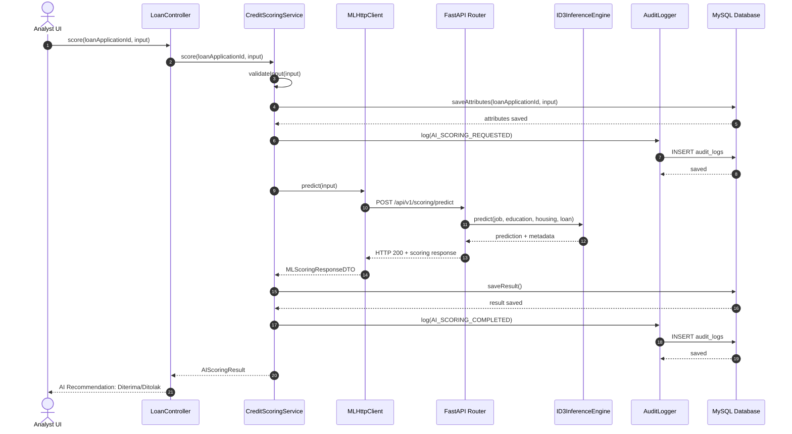
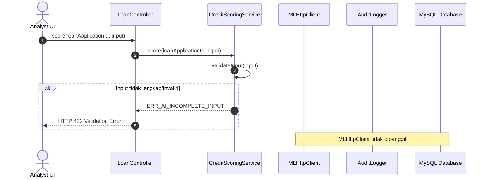
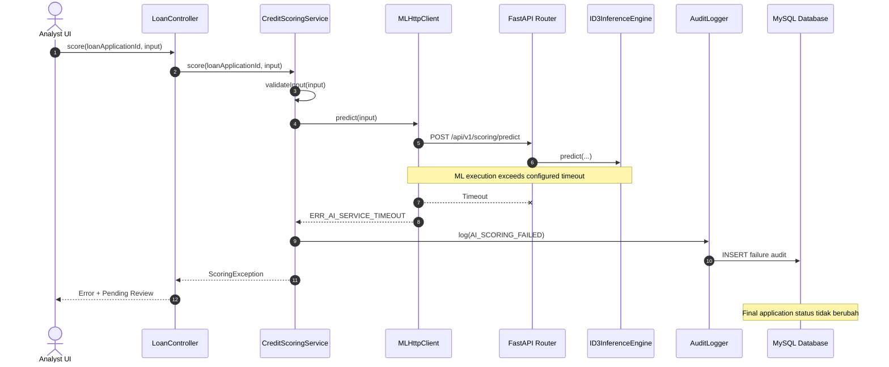
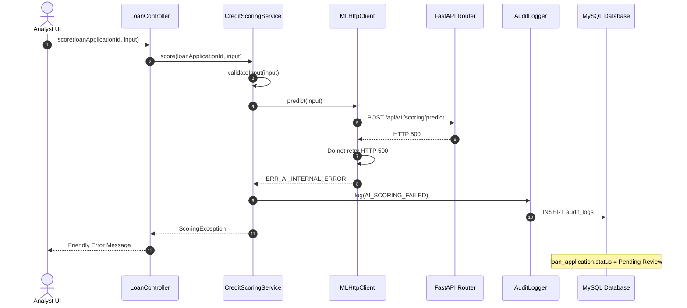

Berikut **DRAF Low-Level Design (LLD)** yang diturunkan langsung dari konteks SRS dan HLD yang Anda berikan. Saya menjaga batas requirement yang sudah ada; bagian yang memang belum ditentukan saya tandai sebagai **[KEPUTUSAN TIM: ...]** atau **[ASUMSI-LLD-XX]**.

# LOW-LEVEL DESIGN (LLD)

## Sistem Informasi Koperasi Simpan Pinjam Berbasis AI — Credit Scoring Engine

**Status:** Draft
**Arsitektur:** Clean Architecture / DDD Ringkas
**Backend Web:** PHP 11 / Laravel 11
**ML Service:** Python 3.11 / FastAPI
**Database:** MySQL 8.0
**Model:** Decision Tree ID3
**Inter-Service:** Synchronous REST API
**HTTP Client:** Guzzle HTTP Client
**ORM:** Eloquent ORM

---

# 1. DESAIN MODUL & CLASS FITUR MUST

## 1.1 Prinsip Desain

Implementasi menggunakan pemisahan tanggung jawab berikut:

```text
Controller / Router
        │
        ▼
Application Service / Use Case
        │
        ├──────────────► Repository
        │
        ├──────────────► External Client
        │
        └──────────────► Audit Logger
                         │
                         ▼
                      MySQL
```

Prinsip penting:

1. Controller hanya menangani HTTP request/response dan authorization boundary.
2. Business logic berada pada Service/Use Case.
3. Akses database dilakukan melalui Repository.
4. Validasi request dilakukan melalui Request/DTO.
5. Komunikasi Laravel → FastAPI dilakukan melalui client khusus.
6. AI tidak mempunyai kewenangan mengubah keputusan final.
7. `AI recommendation` dan `Analyst decision` disimpan pada entitas yang berbeda.
8. Kegagalan ML Service tidak boleh menghasilkan keputusan final otomatis.

---

## 1.2 Modul Loan Application Management

### Class: `LoanApplicationController`

**Responsibilitas:**

* Menerima HTTP request terkait pengajuan pinjaman.
* Melakukan authorization melalui middleware/policy.
* Memanggil application service.
* Mengembalikan HTTP response.

**Key Attributes:**

| Attribute                | Type                     | Keterangan          |
| ------------------------ | ------------------------ | ------------------- |
| `loanApplicationService` | `LoanApplicationService` | Application service |

**Key Methods:**

```php
create(CreateLoanApplicationRequest $request): JsonResponse

show(int $loanApplicationId): JsonResponse

index(LoanApplicationFilterDTO $filter): JsonResponse
```

---

### Class: `LoanApplicationService`

**Responsibilitas:**

* Mengelola business workflow pengajuan pinjaman.
* Mengambil dan menyimpan data pengajuan.
* Memastikan status awal sesuai workflow.
* Menjadi application boundary sebelum proses scoring.

**Key Attributes:**

| Attribute                   | Type                                 |
| --------------------------- | ------------------------------------ |
| `loanApplicationRepository` | `LoanApplicationRepositoryInterface` |
| `memberRepository`          | `MemberRepositoryInterface`          |
| `auditLogger`               | `AuditLoggerInterface`               |

**Key Methods:**

```php
createApplication(
    int $memberId,
    CreateLoanApplicationDTO $data
): LoanApplication

getApplication(int $loanApplicationId): LoanApplication

getApplications(
    LoanApplicationFilterDTO $filter
): Collection

updateApplicationStatus(
    int $loanApplicationId,
    LoanApplicationStatus $status
): LoanApplication
```

`LoanApplicationService` **tidak** menentukan keputusan AI dan tidak melakukan inferensi ID3.

---

### Class: `LoanApplicationRepository`

**Responsibilitas:**

* Data access untuk `loan_applications`.
* Menggunakan Eloquent ORM.
* Tidak mengandung business decision.

**Key Methods:**

```php
findById(int $loanApplicationId): ?LoanApplication

findByMemberId(
    int $memberId
): Collection

findAll(
    LoanApplicationFilterDTO $filter
): Collection

save(LoanApplication $application): LoanApplication

updateStatus(
    int $loanApplicationId,
    LoanApplicationStatus $status
): bool
```

---

### Class: `CreateLoanApplicationRequest`

**Responsibilitas:**

* Validasi input HTTP untuk pembuatan pengajuan.

Contoh aturan:

```php
member_id => required|integer
```

Validasi AI **tidak ditempatkan sepenuhnya di class ini**, karena atribut scoring mempunyai workflow tersendiri.

---

### Class: `LoanApplication`

**Responsibilitas:**

* Merepresentasikan domain/entity pengajuan pinjaman.

**Key Attributes:**

```php
int $id;
int $memberId;
string $status;
DateTime $createdAt;
DateTime $updatedAt;
```

Status yang relevan terhadap workflow:

```text
Pending Review
Diterima
Ditolak
```

---

# 1.3 Modul AI Credit Scoring Orchestrator

## Class: `CreditScoringController`

**Responsibilitas:**

* Endpoint internal Laravel untuk memulai proses scoring.
* Memvalidasi authorization.
* Meneruskan request ke `CreditScoringService`.

**Methods:**

```php
score(
    int $loanApplicationId,
    ScoreLoanApplicationRequest $request
): JsonResponse
```

---

## Class: `CreditScoringService`

**Responsibilitas utama:**

* Mengorkestrasi seluruh proses scoring.
* Memastikan 4 atribut lengkap dan valid.
* Memanggil ML Service.
* Menyimpan hasil AI.
* Tidak menetapkan keputusan final.

**Key Attributes:**

| Attribute                   | Type                                    |
| --------------------------- | --------------------------------------- |
| `attributeRepository`       | `AIScoringAttributeRepositoryInterface` |
| `resultRepository`          | `AIScoringResultRepositoryInterface`    |
| `loanApplicationRepository` | `LoanApplicationRepositoryInterface`    |
| `mlClient`                  | `MLScoringClientInterface`              |
| `auditLogger`               | `AuditLoggerInterface`                  |

**Key Methods:**

```php
score(
    int $loanApplicationId,
    AIScoringInputDTO $input
): AIScoringResult
```

```php
validateInput(
    AIScoringInputDTO $input
): void
```

```php
saveAttributes(
    int $loanApplicationId,
    AIScoringInputDTO $input
): AIScoringAttribute
```

```php
saveResult(
    int $loanApplicationId,
    MLScoringResponseDTO $response
): AIScoringResult
```

```php
handleScoringFailure(
    int $loanApplicationId,
    ScoringException $exception
): void
```

### Aturan penting

`score()` hanya menghasilkan:

```text
AI Recommendation = Yes / No
```

dan **tidak boleh** melakukan:

```php
updateApplicationStatus(..., 'Diterima');
updateApplicationStatus(..., 'Ditolak');
```

Keputusan final hanya dilakukan oleh `AnalystDecisionService`.

---

## Class: `AIScoringInputDTO`

**Key Attributes:**

```php
string $job;
string $education;
string $housing;
string $loan;
```

Keempat field wajib tersedia sebelum request dikirim ke FastAPI.

---

## Class: `MLScoringClient`

**Responsibilitas:**

* Mengirim request synchronous dari Laravel ke FastAPI.
* Mengelola timeout.
* Mengelola retry sesuai policy.
* Memetakan HTTP error menjadi exception domain/application.

**Key Attributes:**

```php
Client $httpClient;
float $timeout;
int $maxRetries;
```

**Key Methods:**

```php
predict(
    AIScoringInputDTO $input
): MLScoringResponseDTO
```

```php
isRetryableStatus(
    int $statusCode
): bool
```

```php
mapException(
    Throwable $exception
): ScoringException
```

---

## Interface: `MLScoringClientInterface`

```php
predict(
    AIScoringInputDTO $input
): MLScoringResponseDTO
```

Tujuannya agar implementasi HTTP client dapat diganti tanpa mengubah `CreditScoringService`.

---

## Class: `AIScoringResult`

**Key Attributes:**

```php
int $id;
int $loanApplicationId;
string $prediction;
string $recommendation;
int $processingTimeMs;
string $modelName;
string $algorithm;
string $modelVersion;
DateTime $createdAt;
DateTime $updatedAt;
```

Nilai:

```text
prediction:
    Yes
    No

recommendation:
    Diterima
    Ditolak
```

---

# 1.4 Modul Analyst Decision & Override Engine

## Class: `AnalystDecisionController`

**Responsibilitas:**

* Menerima keputusan final dari Analis Kredit.
* Memastikan authorization.
* Meneruskan proses ke `AnalystDecisionService`.

**Methods:**

```php
decide(
    int $loanApplicationId,
    AnalystDecisionRequest $request
): JsonResponse
```

```php
override(
    int $loanApplicationId,
    AnalystOverrideRequest $request
): JsonResponse
```

---

## Class: `AnalystDecisionService`

**Responsibilitas:**

* Menyimpan keputusan final Analis.
* Memproses konfirmasi keputusan.
* Memproses override.
* Memperbarui status pengajuan.
* Mencatat audit trail.

**Key Attributes:**

```php
AnalystDecisionRepositoryInterface $decisionRepository;
AIScoringResultRepositoryInterface $scoringResultRepository;
LoanApplicationRepositoryInterface $loanApplicationRepository;
AuditLoggerInterface $auditLogger;
```

**Key Methods:**

```php
confirmDecision(
    int $loanApplicationId,
    int $analystUserId,
    string $decision
): AnalystDecision
```

```php
overrideDecision(
    int $loanApplicationId,
    int $analystUserId,
    string $decision
): AnalystDecision
```

```php
validateDecision(
    string $decision
): void
```

```php
updateFinalStatus(
    int $loanApplicationId,
    string $decision
): void
```

### Aturan override

Misalnya:

```text
AI Recommendation = No
Analyst Decision  = Diterima
```

Maka:

```text
AI Recommendation tetap = No
Analyst Decision         = Diterima
Final Application Status = Diterima
```

Tidak boleh menimpa nilai rekomendasi AI.

---

## Class: `AnalystDecision`

**Key Attributes:**

```php
int $id;
int $loanApplicationId;
int $analystUserId;
string $decision;
bool $isOverride;
DateTime $createdAt;
DateTime $updatedAt;
```

---

## Class: `AuditLogger`

**Responsibilitas:**

* Mencatat aktivitas penting.
* Tidak mengubah business decision.

**Methods:**

```php
log(
    int $userId,
    string $action,
    string $entityType,
    int $entityId,
    ?array $metadata = null
): AuditLog
```

Contoh aktivitas:

```text
AI_SCORING_REQUESTED
AI_SCORING_COMPLETED
AI_SCORING_FAILED
ANALYST_DECISION_CONFIRMED
ANALYST_DECISION_OVERRIDDEN
```

---

# 1.5 Struktur Direktori yang Disarankan

```text
app/
├── Application/
│   ├── LoanApplications/
│   │   ├── DTO/
│   │   └── Services/
│   │
│   ├── CreditScoring/
│   │   ├── DTO/
│   │   └── Services/
│   │
│   └── AnalystDecisions/
│       ├── DTO/
│       └── Services/
│
├── Domain/
│   ├── LoanApplications/
│   │   ├── Entities/
│   │   ├── Repositories/
│   │   └── Enums/
│   │
│   ├── CreditScoring/
│   │   ├── Entities/
│   │   ├── Repositories/
│   │   └── Exceptions/
│   │
│   └── AnalystDecisions/
│       ├── Entities/
│       └── Repositories/
│
├── Infrastructure/
│   ├── Persistence/
│   │   └── Eloquent/
│   │
│   ├── ML/
│   │   └── FastApi/
│   │
│   └── Audit/
│
└── Http/
    ├── Controllers/
    └── Requests/
```

---

# 2. SKEMA DATA PERSISTENSI

## 2.1 Relasi Entitas

```text
users
  │
  ├───────────────┐
  │               │
  ▼               ▼
members      analyst_decisions
  │               │
  ▼               │
loan_applications ◄┘
  │
  ├──────────────► ai_scoring_attributes
  │
  ├──────────────► ai_scoring_results
  │
  └──────────────► audit_logs
```

Relasi utama:

```text
users 1 ─── 0..1 members

members 1 ─── N loan_applications

loan_applications 1 ─── 1 ai_scoring_attributes

loan_applications 1 ─── N ai_scoring_results

loan_applications 1 ─── N analyst_decisions

loan_applications 1 ─── N audit_logs

users 1 ─── N analyst_decisions

users 1 ─── N audit_logs
```

---

## 2.2 DDL MySQL

> Catatan: tipe `ENUM` digunakan untuk membatasi nilai domain yang memang sudah ditentukan requirement. Nilai kategori `job` dan `education` tetap dapat disesuaikan dengan dataset/domain implementasi tanpa mengubah struktur inti.

```sql
CREATE TABLE users (
    id BIGINT UNSIGNED AUTO_INCREMENT PRIMARY KEY,
    name VARCHAR(150) NOT NULL,
    email VARCHAR(255) NOT NULL UNIQUE,
    password VARCHAR(255) NOT NULL,
    role ENUM(
        'member',
        'admin',
        'credit_analyst',
        'management',
        'auditor'
    ) NOT NULL,
    created_at TIMESTAMP NULL,
    updated_at TIMESTAMP NULL,

    INDEX idx_users_role (role)
);
```

---

```sql
CREATE TABLE members (
    id BIGINT UNSIGNED AUTO_INCREMENT PRIMARY KEY,
    user_id BIGINT UNSIGNED NOT NULL,
    member_number VARCHAR(50) NOT NULL UNIQUE,
    created_at TIMESTAMP NULL,
    updated_at TIMESTAMP NULL,

    CONSTRAINT fk_members_user
        FOREIGN KEY (user_id)
        REFERENCES users(id)
        ON UPDATE CASCADE
        ON DELETE RESTRICT,

    INDEX idx_members_user_id (user_id)
);
```

---

```sql
CREATE TABLE loan_applications (
    id BIGINT UNSIGNED AUTO_INCREMENT PRIMARY KEY,
    member_id BIGINT UNSIGNED NOT NULL,

    status ENUM(
        'Pending Review',
        'Diterima',
        'Ditolak'
    ) NOT NULL DEFAULT 'Pending Review',

    created_at TIMESTAMP NULL,
    updated_at TIMESTAMP NULL,

    CONSTRAINT fk_loan_applications_member
        FOREIGN KEY (member_id)
        REFERENCES members(id)
        ON UPDATE CASCADE
        ON DELETE RESTRICT,

    INDEX idx_loan_applications_member_id (member_id),
    INDEX idx_loan_applications_status (status),
    INDEX idx_loan_applications_created_at (created_at)
);
```

---

```sql
CREATE TABLE ai_scoring_attributes (
    id BIGINT UNSIGNED AUTO_INCREMENT PRIMARY KEY,
    loan_application_id BIGINT UNSIGNED NOT NULL,

    job VARCHAR(100) NOT NULL,
    education VARCHAR(100) NOT NULL,

    housing ENUM(
        'Yes',
        'No'
    ) NOT NULL,

    loan ENUM(
        'Yes',
        'No'
    ) NOT NULL,

    created_at TIMESTAMP NULL,
    updated_at TIMESTAMP NULL,

    CONSTRAINT fk_ai_attributes_loan_application
        FOREIGN KEY (loan_application_id)
        REFERENCES loan_applications(id)
        ON UPDATE CASCADE
        ON DELETE RESTRICT,

    UNIQUE KEY uq_ai_attributes_loan_application (
        loan_application_id
    ),

    INDEX idx_ai_attributes_loan_application_id (
        loan_application_id
    )
);
```

---

```sql
CREATE TABLE ai_scoring_results (
    id BIGINT UNSIGNED AUTO_INCREMENT PRIMARY KEY,
    loan_application_id BIGINT UNSIGNED NOT NULL,

    prediction ENUM(
        'Yes',
        'No'
    ) NOT NULL,

    recommendation ENUM(
        'Diterima',
        'Ditolak'
    ) NOT NULL,

    processing_time_ms INT UNSIGNED NOT NULL,

    model_name VARCHAR(100) NOT NULL,
    algorithm VARCHAR(100) NOT NULL,
    model_version VARCHAR(50) NOT NULL,

    created_at TIMESTAMP NULL,
    updated_at TIMESTAMP NULL,

    CONSTRAINT fk_ai_results_loan_application
        FOREIGN KEY (loan_application_id)
        REFERENCES loan_applications(id)
        ON UPDATE CASCADE
        ON DELETE RESTRICT,

    INDEX idx_ai_results_loan_application_id (
        loan_application_id
    ),

    INDEX idx_ai_results_created_at (
        created_at
    )
);
```

`ai_scoring_results` dibuat **one-to-many** terhadap pengajuan agar riwayat scoring dapat dipertahankan apabila proses scoring dijalankan lebih dari satu kali.

---

```sql
CREATE TABLE analyst_decisions (
    id BIGINT UNSIGNED AUTO_INCREMENT PRIMARY KEY,
    loan_application_id BIGINT UNSIGNED NOT NULL,
    analyst_user_id BIGINT UNSIGNED NOT NULL,

    decision ENUM(
        'Diterima',
        'Ditolak'
    ) NOT NULL,

    is_override BOOLEAN NOT NULL DEFAULT FALSE,

    created_at TIMESTAMP NULL,
    updated_at TIMESTAMP NULL,

    CONSTRAINT fk_analyst_decisions_loan_application
        FOREIGN KEY (loan_application_id)
        REFERENCES loan_applications(id)
        ON UPDATE CASCADE
        ON DELETE RESTRICT,

    CONSTRAINT fk_analyst_decisions_user
        FOREIGN KEY (analyst_user_id)
        REFERENCES users(id)
        ON UPDATE CASCADE
        ON DELETE RESTRICT,

    INDEX idx_analyst_decisions_loan_application_id (
        loan_application_id
    ),

    INDEX idx_analyst_decisions_user_id (
        analyst_user_id
    )
);
```

---

```sql
CREATE TABLE audit_logs (
    id BIGINT UNSIGNED AUTO_INCREMENT PRIMARY KEY,

    user_id BIGINT UNSIGNED NULL,

    entity_type VARCHAR(100) NOT NULL,
    entity_id BIGINT UNSIGNED NOT NULL,

    action VARCHAR(100) NOT NULL,

    metadata JSON NULL,

    created_at TIMESTAMP NULL,
    updated_at TIMESTAMP NULL,

    CONSTRAINT fk_audit_logs_user
        FOREIGN KEY (user_id)
        REFERENCES users(id)
        ON UPDATE CASCADE
        ON DELETE SET NULL,

    INDEX idx_audit_logs_user_id (
        user_id
    ),

    INDEX idx_audit_logs_entity (
        entity_type,
        entity_id
    ),

    INDEX idx_audit_logs_action (
        action
    ),

    INDEX idx_audit_logs_created_at (
        created_at
    )
);
```

### Catatan skema

Tidak terdapat foreign key langsung antara:

```text
ai_scoring_results
```

dan:

```text
analyst_decisions
```

karena keduanya memang harus menjadi dua entitas terpisah. Keduanya berelasi melalui:

```text
loan_applications
```

Hal ini menjaga pemisahan:

```text
AI Recommendation ≠ Analyst Final Decision
```

---

# 3. SPESIFIKASI REST API DETAIL

## 3.1 Endpoint

```http
POST /api/v1/scoring/predict
```

**Purpose:** meminta prediksi kelayakan dari Python ML Service.

**Caller:**

```text
Laravel CreditScoringService
        ↓
MLScoringClient
        ↓
FastAPI
```

---

## 3.2 Request Headers

```http
Content-Type: application/json
Accept: application/json
X-API-Key: <internal-service-api-key>
```

`X-API-Key` digunakan untuk autentikasi komunikasi internal Laravel → FastAPI.

---

## 3.3 Request Payload

```json
{
    "job": "private",
    "education": "secondary",
    "housing": "Yes",
    "loan": "No"
}
```

### Contract

| Field       | Type   | Required | Constraint         |
| ----------- | ------ | -------: | ------------------ |
| `job`       | string |      Yes | Tidak boleh kosong |
| `education` | string |      Yes | Tidak boleh kosong |
| `housing`   | string |      Yes | `Yes` / `No`       |
| `loan`      | string |      Yes | `Yes` / `No`       |

---

# 3.4 FastAPI Request DTO

Contoh menggunakan Pydantic:

```python
class ScoringRequest(BaseModel):
    job: str
    education: str
    housing: Literal["Yes", "No"]
    loan: Literal["Yes", "No"]
```

---

# 3.5 Response 200 OK

```json
{
    "success": true,
    "prediction": "Yes",
    "recommendation": "Diterima",
    "processing_time_ms": 125,
    "model_metadata": {
        "model_name": "Decision Tree",
        "algorithm": "ID3",
        "model_version": "1.0"
    }
}
```

---

# 3.6 Response 422 — Validation Error

```json
{
    "success": false,
    "error": {
        "code": "ERR_AI_INCOMPLETE_INPUT",
        "message": "Atribut Loan wajib diisi"
    }
}
```

Contoh invalid enum:

```json
{
    "success": false,
    "error": {
        "code": "ERR_AI_INVALID_INPUT",
        "message": "Atribut Housing harus bernilai Yes atau No"
    }
}
```

---

# 3.7 Response 503 — ML Service Unavailable

```json
{
    "success": false,
    "error": {
        "code": "ERR_AI_SERVICE_UNAVAILABLE",
        "message": "Proses scoring AI mengalami batas waktu/gagal"
    }
}
```

---

# 3.8 Response 500 — Internal Error

```json
{
    "success": false,
    "error": {
        "code": "ERR_AI_INTERNAL_ERROR",
        "message": "Terjadi kesalahan internal pada Credit Scoring Engine"
    }
}
```

---

# 3.9 System Error Codes

| Code                         | Kondisi                           |
| ---------------------------- | --------------------------------- |
| `ERR_AI_INCOMPLETE_INPUT`    | Salah satu dari 4 atribut kosong  |
| `ERR_AI_INVALID_INPUT`       | Nilai atribut tidak valid         |
| `ERR_AI_SERVICE_TIMEOUT`     | ML Service melewati batas timeout |
| `ERR_AI_SERVICE_UNAVAILABLE` | ML Service tidak tersedia         |
| `ERR_AI_INTERNAL_ERROR`      | Internal error pada ML Service    |
| `ERR_AI_INVALID_RESPONSE`    | Response ML tidak sesuai contract |
| `ERR_AI_UNAUTHORIZED`        | API key internal tidak valid      |

---

# 3.10 FastAPI Layer

Struktur internal:

```text
FastAPI Router
      │
      ▼
ScoringService
      │
      ▼
ID3InferenceEngine
      │
      ▼
ScoringResponse
```

### `ScoringRouter`

```python
predict(
    request: ScoringRequest
) -> ScoringResponse
```

### `ScoringService`

```python
predict(
    request: ScoringRequest
) -> ScoringResponse
```

### `ID3InferenceEngine`

```python
predict(
    job: str,
    education: str,
    housing: str,
    loan: str
) -> ID3Prediction
```

Engine hanya menghasilkan prediksi dan metadata model.

---

# 4. SEQUENCE DIAGRAM & ALUR DETAIL FITUR AI

## 4.1 Happy Path



**Catatan:** Pada tahap ini status `loan_applications.status` tetap:

```text
Pending Review
```

Keputusan final belum dibuat.

---

# 4.2 Input Validation Error



Aturan penting:

```text
3/4 atribut valid
        ↓
Validation Error
        ↓
ML Service tidak dipanggil
        ↓
Tidak ada AI recommendation baru
        ↓
Status tetap Pending Review
```

---

# 4.3 Timeout Execution > 5 Detik



---

# 4.4 ML Service Failure — HTTP 500



---

# 5. ERROR HANDLING, RETRY, & FALLBACK

## 5.1 Timeout Configuration

NFR-05 menetapkan:

```text
AI scoring ≤ 5 detik
```

Konfigurasi HTTP client dirancang dengan timeout:

```text
timeout = 4.5 seconds
```

Dengan demikian terdapat buffer terhadap batas SLA 5 detik untuk proses Laravel, exception handling, persistence, dan response.

Contoh konfigurasi Guzzle:

```php
$this->client = new Client([
    'base_uri' => config('services.ml.base_url'),
    'timeout' => 4.5,
    'connect_timeout' => 1.0,
    'headers' => [
        'Accept' => 'application/json',
        'Content-Type' => 'application/json',
        'X-API-Key' => config('services.ml.api_key'),
    ],
]);
```

### Catatan

Nilai timeout efektif harus divalidasi melalui integration/performance testing karena total waktu end-to-end mencakup:

```text
Laravel
 + network
 + FastAPI
 + ID3 inference
 + response
 + persistence
```

---

# 5.2 Retry Policy

Policy yang digunakan:

| HTTP Condition            |                                    Retry |
| ------------------------- | ---------------------------------------: |
| 400                       |                                    Tidak |
| 401                       |                                    Tidak |
| 403                       |                                    Tidak |
| 422                       |                                    Tidak |
| 500                       |                                    Tidak |
| 502                       |                                       Ya |
| 503                       |                                       Ya |
| 504                       |                                       Ya |
| Timeout                   | Mengikuti policy timeout yang ditetapkan |
| Network temporary failure |                    Dapat dipertimbangkan |

Konfigurasi utama:

```text
Maximum retry = 2
```

Backoff:

```text
Attempt 1
   ↓
500 ms

Attempt 2
   ↓
1000 ms
```

Formula konseptual:

```text
delay = baseDelay × 2^(attempt - 1)
```

### Pembatasan

Retry **tidak boleh** digunakan pada HTTP 4xx karena request tersebut secara umum membutuhkan koreksi input/authorization, bukan pengulangan request yang sama.

---

# 5.3 Retry dan SLA

Retry harus memperhitungkan NFR-05.

Jika dua retry dijalankan secara penuh dengan timeout 4,5 detik, total waktu dapat melebihi SLA.

Oleh karena itu, implementasi final sebaiknya menggunakan **overall deadline/budget** pada level `CreditScoringService`, bukan sekadar menjumlahkan timeout setiap attempt.

Contoh konsep:

```text
Overall scoring budget
        │
        ├── Attempt 1
        ├── Backoff
        ├── Attempt 2
        └── Backoff/Final Attempt
```

[KEPUTUSAN TIM: Tentukan apakah retry harus menggunakan overall deadline ≤5 detik atau retry hanya digunakan pada kondisi tertentu dengan timeout per-attempt yang lebih kecil.]

---

# 5.4 Fallback State Logic

Aturan:

```text
Input valid
     ↓
Call ML Service
     ↓
Success?
 ┌───┴───┐
Yes      No
 │        │
 ▼        ▼
AI       Audit Failure
Result      │
 │          ▼
 ▼       Error Response
Pending      │
Review       ▼
         Pending Review
```

Ketika terjadi:

```text
Timeout
HTTP 503
HTTP 504
HTTP 500
Invalid ML Response
```

maka:

```text
loan_applications.status
        =
Pending Review
```

Tidak boleh:

```text
AI Failure
   ↓
Diterima
```

dan tidak boleh:

```text
AI Failure
   ↓
Ditolak
```

### Alasan desain

Sesuai BR-01 dan BR-06, AI hanya berfungsi sebagai decision-support tool.

Sesuai NFR-13/NFR-14, kegagalan scoring tidak boleh menghasilkan keputusan final otomatis.

Dengan demikian:

```text
ML failure ≠ credit decision
```

Keputusan final hanya berasal dari:

```text
AnalystDecisionService
```

---

# 5.5 Exception Hierarchy

Struktur exception yang disarankan:

```text
ScoringException
├── ScoringValidationException
├── ScoringTimeoutException
├── ScoringServiceUnavailableException
├── ScoringInternalException
└── InvalidScoringResponseException
```

Contoh:

```php
class ScoringTimeoutException extends ScoringException
{
}
```

Controller melakukan mapping:

```text
ScoringValidationException
        → HTTP 422

ScoringTimeoutException
        → HTTP 503

ScoringServiceUnavailableException
        → HTTP 503

ScoringInternalException
        → HTTP 500
```

---

# 5.6 Pilihan Teknologi yang Belum Diputus

## A. HTTP Client Laravel

### Opsi 1 — Guzzle HTTP Client

```text
CreditScoringService
       ↓
MLScoringClient
       ↓
Guzzle
       ↓
FastAPI
```

Kelebihan:

* Kontrol timeout dan retry lebih eksplisit.
* Cocok untuk dedicated integration client.
* Sesuai stack HLD.

Kekurangan:

* Konfigurasi lebih verbose.

### Opsi 2 — Laravel HTTP Facade

```text
CreditScoringService
       ↓
Http::timeout()
       ↓
FastAPI
```

Kelebihan:

* Sintaks lebih ringkas.
* Integrasi natural dengan Laravel.

Kekurangan:

* Abstraksi Laravel lebih kuat.
* Implementasi dedicated client perlu tetap dibuat agar domain tidak bergantung langsung pada facade.

**Kriteria:** testability, kontrol timeout/retry, konsistensi arsitektur, dan maintainability.

**[KEPUTUSAN TIM: Guzzle HTTP Client / Laravel HTTP Facade]**

---

## B. Python Request Validation

### Opsi 1 — Pydantic

```python
class ScoringRequest(BaseModel):
    job: str
    education: str
    housing: Literal["Yes", "No"]
    loan: Literal["Yes", "No"]
```

Kelebihan:

* Integrasi native dengan FastAPI.
* Automatic validation.
* Automatic OpenAPI schema.

### Opsi 2 — Marshmallow

Kelebihan:

* Fleksibel untuk schema validation.
* Dapat digunakan di berbagai framework Python.

Kekurangan:

* Tidak senatural Pydantic untuk FastAPI.

**Kriteria:** integrasi FastAPI, schema generation, validation, maintainability.

**[KEPUTUSAN TIM: Pydantic / Marshmallow]**

Rekomendasi implementasi berdasarkan stack yang telah ditetapkan: **Pydantic**.

---

# 6. TRACEABILITY LLD ↔ FR/NFR/BR

## 6.1 Matriks Traceability

| Elemen LLD                                   | FR                         | NFR                    | BR                  | Implementasi                  |
| -------------------------------------------- | -------------------------- | ---------------------- | ------------------- | ----------------------------- |
| `LoanApplicationController`                  | FR-02, FR-03               | NFR-08, NFR-09         | BR-03               | Laravel Controller            |
| `LoanApplicationService.createApplication()` | FR-02                      | NFR-09                 | BR-03               | Application Service           |
| `LoanApplicationRepository`                  | FR-02, FR-03               | NFR-10                 | BR-03               | Eloquent                      |
| `CreditScoringController`                    | FR-04, FR-05               | NFR-08, NFR-09         | BR-01, BR-02        | Laravel Controller            |
| `CreditScoringService.score()`               | FR-04, FR-05, FR-06, FR-07 | NFR-05, NFR-13, NFR-14 | BR-01, BR-02, BR-06 | Application Service           |
| `CreditScoringService.validateInput()`       | FR-04                      | NFR-05                 | BR-02               | Domain/Application Validation |
| `AIScoringInputDTO`                          | FR-04, FR-06               | NFR-09                 | BR-02               | DTO                           |
| `MLScoringClient.predict()`                  | FR-05, FR-06               | NFR-05, NFR-13, NFR-14 | BR-01               | Guzzle                        |
| `ID3InferenceEngine.predict()`               | FR-05, FR-07               | NFR-05                 | BR-01               | Python/FastAPI                |
| `ai_scoring_attributes`                      | FR-04, FR-06               | NFR-10                 | BR-02, BR-06        | MySQL                         |
| `ai_scoring_results`                         | FR-05, FR-06, FR-07        | NFR-05, NFR-10         | BR-01, BR-06        | MySQL                         |
| `CreditScoringService.saveResult()`          | FR-07                      | NFR-10                 | BR-01, BR-06        | Eloquent Repository           |
| `AnalystDecisionController`                  | FR-09, FR-10               | NFR-08, NFR-09         | BR-01, BR-05, BR-06 | Laravel Controller            |
| `AnalystDecisionService.confirmDecision()`   | FR-09, FR-11               | NFR-09, NFR-13         | BR-01, BR-06        | Application Service           |
| `AnalystDecisionService.overrideDecision()`  | FR-10, FR-11               | NFR-09, NFR-13         | BR-05, BR-06        | Application Service           |
| `analyst_decisions`                          | FR-09, FR-10               | NFR-10                 | BR-01, BR-05, BR-06 | MySQL                         |
| `LoanApplicationRepository.updateStatus()`   | FR-11                      | NFR-13, NFR-14         | BR-01, BR-06        | Eloquent                      |
| `AuditLogger.log()`                          | FR-14                      | NFR-10, NFR-14         | BR-01, BR-05, BR-06 | Laravel/MySQL                 |
| `audit_logs`                                 | FR-14                      | NFR-10, NFR-14         | BR-01, BR-05, BR-06 | MySQL                         |
| `MLScoringClient` timeout                    | FR-05, FR-06               | NFR-05, NFR-13, NFR-14 | BR-01, BR-06        | Guzzle                        |
| Retry Policy                                 | FR-05, FR-06               | NFR-05, NFR-13, NFR-14 | BR-01               | Guzzle                        |
| Fallback `Pending Review`                    | FR-05, FR-06, FR-11        | NFR-13, NFR-14         | BR-01, BR-06        | `CreditScoringService`        |
| FastAPI `POST /api/v1/scoring/predict`       | FR-05, FR-06, FR-07        | NFR-05                 | BR-01, BR-02        | FastAPI                       |
| `ScoringRequest`                             | FR-04, FR-06               | NFR-05                 | BR-02               | Pydantic                      |
| `ID3InferenceEngine`                         | FR-05, FR-07               | NFR-05                 | BR-01               | Scikit-learn/ID3              |
| RBAC Middleware/Policy                       | FR-09, FR-10, FR-14        | NFR-08, NFR-09, NFR-10 | BR-01, BR-05, BR-06 | Laravel Authorization         |

---

## 6.2 NFR yang Tidak Boleh Hilang pada Implementasi

| NFR    | Implementasi LLD                                       |
| ------ | ------------------------------------------------------ |
| NFR-05 | Guzzle timeout, retry budget, FastAPI inference timing |
| NFR-08 | Authentication + middleware/policy                     |
| NFR-09 | RBAC + authorization pada backend                      |
| NFR-10 | Repository access control + database FK/index          |
| NFR-13 | Exception handling + no automatic final decision       |
| NFR-14 | Fallback `Pending Review` + AuditLogger                |

---

# 7. KONSISTENSI BUSINESS RULE

## BR-01 / BR-06 — AI sebagai Decision Support

Implementasi:

```text
ID3
 ↓
AI Recommendation
 ↓
Analyst Review
 ↓
Analyst Decision
 ↓
Final Application Status
```

Tidak boleh:

```text
ID3
 ↓
Final Application Status
```

---

## BR-02 — Empat Atribut Wajib

Scoring hanya berjalan apabila:

```text
job       ✓
education ✓
housing   ✓
loan      ✓
```

Jika:

```text
3/4
```

maka:

```text
HTTP 422
+
ERR_AI_INCOMPLETE_INPUT
+
ML tidak dipanggil
```

---

## BR-05 — Override

Contoh:

```text
AI Recommendation = Diterima
Analyst Decision  = Ditolak
is_override       = true
```

atau:

```text
AI Recommendation = Ditolak
Analyst Decision  = Diterima
is_override       = true
```

Kedua nilai tetap disimpan secara terpisah.

---

# 8. BATASAN IMPLEMENTASI LLD

LLD ini **tidak menetapkan** hal-hal berikut karena berada di luar requirement yang diberikan atau menjadi bagian desain implementasi lebih rendah:

```text
- Detail algoritma matematis ID3
- Hyperparameter model
- Struktur source code lengkap
- Migration Laravel lengkap
- Seeder
- SQL query bisnis detail
- Detail UI/UX
- Deployment server configuration
- Kubernetes
- CI/CD pipeline
- Secret management infrastructure
- Detail algoritma enkripsi
- Infrastruktur observability
```

Bagian tersebut dapat diturunkan pada dokumen implementasi, API specification, database migration design, atau deployment design.

---

# 9. RINGKASAN KOMPONEN IMPLEMENTASI

```text
                    ┌──────────────────────┐
                    │      Analyst UI      │
                    └──────────┬───────────┘
                               │
                               ▼
                    ┌──────────────────────┐
                    │ LoanApplication /    │
                    │ CreditScoring        │
                    │ Controller           │
                    └──────────┬───────────┘
                               │
                               ▼
                    ┌──────────────────────┐
                    │ CreditScoringService  │
                    └───────┬─────────┬────┘
                            │         │
                 ┌──────────┘         └──────────┐
                 ▼                               ▼
       ┌──────────────────┐             ┌────────────────┐
       │ Repository Layer │             │ MLScoringClient │
       └────────┬─────────┘             └───────┬────────┘
                │                               │
                ▼                               ▼
          ┌───────────┐                ┌──────────────────┐
          │  MySQL    │                │ FastAPI          │
          │  8.0      │                │ Scoring Router   │
          └───────────┘                └────────┬─────────┘
                                               │
                                               ▼
                                      ┌──────────────────┐
                                      │ ID3InferenceEngine│
                                      └──────────────────┘


             Final Decision Flow

       AI Recommendation
                │
                ▼
       ┌─────────────────┐
       │ AnalystDecision │
       │    Service      │
       └────────┬────────┘
                │
        Confirm / Override
                │
                ▼
       Analyst Final Decision
                │
                ▼
       Loan Application Status
```

**Prinsip arsitektur utama:** Laravel tetap menjadi **otoritas business decision**, sedangkan FastAPI/ID3 hanya menyediakan **AI recommendation**. Dengan desain tersebut, kegagalan atau keterlambatan ML tidak dapat secara otomatis menghasilkan keputusan `Diterima` atau `Ditolak`.

Catatan penting untuk tahap berikutnya: ada satu hal yang sengaja saya pertahankan sebagai **keputusan tim**, yaitu konflik potensial antara `timeout 4,5 detik + maksimal 2 retry` dan **NFR-05 ≤5 detik**. Jika setiap retry mendapat timeout penuh 4,5 detik, SLA jelas dapat terlampaui. Karena itu implementasi sebaiknya memakai **overall request deadline/budget ≤5 detik**, bukan menjadikan 4,5 detik sebagai timeout penuh untuk setiap attempt.
