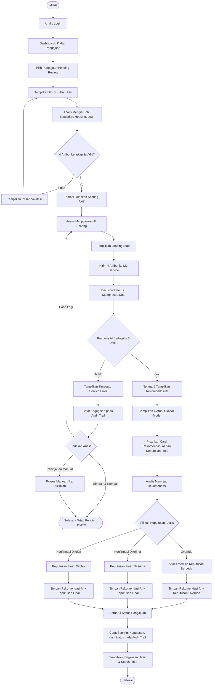

# DRAFT USER FLOW

## Sistem Informasi Koperasi Simpan Pinjam Berbasis AI

### ★ AI Credit Scoring Engine & Pengajuan Pinjaman Anggota

**Platform:** Web Application
**Fitur AI:** Decision Tree (ID3)
**Aktor utama fitur AI:** Analis Kredit
**Aktor utama fitur pendukung:** Anggota/Nasabah
**Prinsip UX utama:** AI memberikan rekomendasi, sedangkan keputusan final tetap berada pada Analis Kredit.

> **Catatan:** Dokumen ini berfokus pada alur interaksi pengguna dan perilaku antarmuka. Detail arsitektur, struktur database, dan desain teknis tidak dibahas.

---

# 1. LANGKAH ALUR PENGGUNA (*END-TO-END USER STEP FLOW*)

## Alur A — ★ Penilaian Kredit & Pengambilan Keputusan oleh Analis Kredit

### Tujuan Alur

Membantu **Pak Budi sebagai Analis Kredit** menilai pengajuan secara cepat dan terstruktur, memahami rekomendasi AI, serta menetapkan keputusan final tanpa kehilangan kendali atas keputusan kredit.

### Entry Point

**Dashboard Analis → Daftar Pengajuan → Pilih pengajuan berstatus `Pending Review` → Halaman Detail Penilaian**

### Alur Langkah demi Langkah

| Step ID  | Aktor                | Aktivitas Pengguna / Sistem                                                                                                  | Output / Kondisi                                         |
| -------- | -------------------- | ---------------------------------------------------------------------------------------------------------------------------- | -------------------------------------------------------- |
| **A-01** | Analis               | Login ke sistem menggunakan akun Analis Kredit.                                                                              | Dashboard Analis ditampilkan.                            |
| **A-02** | Analis               | Membuka menu **Daftar Pengajuan**.                                                                                           | Daftar pengajuan yang menjadi kewenangannya ditampilkan. |
| **A-03** | Analis               | Memilih pengajuan berstatus **`Pending Review`**.                                                                            | Halaman detail pengajuan terbuka.                        |
| **A-04** | Sistem               | Menampilkan data pengajuan dan formulir **4 atribut AI**.                                                                    | Form Job, Education, Housing, dan Loan tersedia.         |
| **A-05** | Analis               | Mengisi **Job** dan **Education** sesuai data pengajuan.                                                                     | Data atribut nominal terisi.                             |
| **A-06** | Analis               | Memilih **Housing = Yes/No** dan **Loan = Yes/No**.                                                                          | Seluruh atribut AI terisi.                               |
| **A-07** | Sistem               | Melakukan validasi awal kelengkapan dan format input.                                                                        | Jika valid, tombol scoring aktif.                        |
| **A-08** | Analis               | Menekan tombol **“Jalankan Penilaian AI”**.                                                                                  | Sistem memulai proses scoring.                           |
| **A-09** | Sistem Web           | Mengirim empat atribut valid ke **Credit Scoring Engine**.                                                                   | Permintaan scoring diproses.                             |
| **A-10** | ML Service           | Memproses data menggunakan **Decision Tree (ID3)**.                                                                          | Model menghasilkan rekomendasi.                          |
| **A-11** | Sistem Web           | Menerima hasil scoring dan memeriksa waktu respons.                                                                          | Hasil diterima jika proses ≤ 5 detik.                    |
| **A-12** | Sistem               | Menampilkan **Card Rekomendasi AI**: `Yes/Diterima` atau `No/Ditolak`.                                                       | Rekomendasi AI terlihat jelas.                           |
| **A-13** | Sistem               | Menampilkan **atribut dasar yang digunakan model**.                                                                          | Analis dapat memahami dasar input penilaian.             |
| **A-14** | Analis               | Meninjau rekomendasi AI dan informasi pengajuan.                                                                             | Analis melakukan pertimbangan manusia.                   |
| **A-15** | Analis               | Memilih salah satu aksi pada area keputusan final: **“Konfirmasi Diterima”**, **“Konfirmasi Ditolak”**, atau **“Override”**. | Sistem memproses pilihan Analis.                         |
| **A-16** | Sistem               | Menyimpan rekomendasi AI dan keputusan final secara terpisah.                                                                | Riwayat rekomendasi dan keputusan terjaga.               |
| **A-17** | Sistem               | Memperbarui status pengajuan sesuai keputusan final Analis.                                                                  | Status menjadi **`Diterima`** atau **`Ditolak`**.        |
| **A-18** | Sistem / Audit Trail | Mencatat aktivitas scoring, rekomendasi, konfirmasi/override, dan perubahan status.                                          | Audit Trail tersimpan.                                   |
| **A-19** | Sistem               | Menampilkan ringkasan hasil dan status akhir kepada Analis.                                                                  | Proses selesai.                                          |

### Catatan UX Alur A

* **Rekomendasi AI dan keputusan final harus berada dalam dua card/section yang berbeda.**
* Tombol **“Konfirmasi Diterima”** dan **“Konfirmasi Ditolak”** harus berada di area **Keputusan Final Analis**, bukan di dalam card rekomendasi AI.
* Tombol **“Override”** harus memiliki label yang jelas, misalnya **“Tetapkan Keputusan Berbeda”**.
* Status `Pending Review` tidak boleh berubah hanya karena AI selesai melakukan scoring.
* Setelah keputusan final disimpan, sistem perlu menampilkan ringkasan:

  * Rekomendasi AI
  * Keputusan final Analis
  * Status pengajuan
  * Waktu proses/keputusan — **[ASUMSI-UX-01]**, jika dibutuhkan untuk transparansi.

---

## Alur B — Pengajuan Pinjaman & Tracking Status oleh Anggota

### Tujuan Alur

Membantu **Mbak Siti sebagai Anggota Koperasi** mengajukan pinjaman dengan langkah sederhana dan memantau status pengajuan secara mandiri.

### Entry Point

**Login Anggota → Dashboard Anggota → Menu Pengajuan Pinjaman**

### Alur Langkah demi Langkah

| Step ID  | Aktor   | Aktivitas Pengguna / Sistem                                          | Output / Kondisi                            |
| -------- | ------- | -------------------------------------------------------------------- | ------------------------------------------- |
| **B-01** | Anggota | Login ke sistem menggunakan akun anggota.                            | Dashboard Anggota ditampilkan.              |
| **B-02** | Anggota | Memilih menu **“Ajukan Pinjaman”**.                                  | Form pengajuan pinjaman ditampilkan.        |
| **B-03** | Anggota | Mengisi data pengajuan yang disediakan sistem.                       | Data pengajuan terisi.                      |
| **B-04** | Sistem  | Melakukan validasi data pengajuan sebelum dikirim.                   | Jika valid, pengajuan dapat dikirim.        |
| **B-05** | Anggota | Menekan tombol **“Kirim Pengajuan”**.                                | Sistem menerima pengajuan.                  |
| **B-06** | Sistem  | Menyimpan pengajuan dan menetapkan status awal **`Pending Review`**. | Pengajuan tercatat.                         |
| **B-07** | Sistem  | Menampilkan konfirmasi bahwa pengajuan berhasil dikirim.             | Anggota memperoleh kepastian pengiriman.    |
| **B-08** | Anggota | Membuka menu **“Riwayat Pengajuan”**.                                | Daftar pengajuan milik anggota ditampilkan. |
| **B-09** | Sistem  | Menampilkan status setiap pengajuan milik anggota.                   | Status dapat dipantau secara mandiri.       |
| **B-10** | Anggota | Memilih salah satu pengajuan untuk melihat detail status.            | Detail pengajuan dan status ditampilkan.    |
| **B-11** | Sistem  | Menampilkan status terbaru sesuai proses koperasi.                   | Anggota mengetahui perkembangan pengajuan.  |

### Catatan UX Alur B

* Gunakan istilah status yang konsisten, misalnya:

  * **`Pending Review`** — Menunggu penilaian
  * **`Diterima`** — Pengajuan diterima
  * **`Ditolak`** — Pengajuan ditolak
* Status harus mudah ditemukan pada daftar pengajuan, tidak hanya di halaman detail.
* Anggota hanya dapat melihat **pengajuan miliknya sendiri**.
* Jangan menampilkan detail internal model AI kepada anggota apabila belum menjadi kebutuhan produk yang ditetapkan.
* **[ASUMSI-UX-02]** Jika status `Pending Review` digunakan sebagai status awal resmi, label dapat diberi padanan bahasa yang lebih mudah dipahami, yaitu **“Menunggu Peninjauan”**.

---

# 2. PENANGANAN 4 STATUS SISTEM UI/UX — KHUSUS FITUR AI

## 2.1 Status A — Validasi Awal di Perangkat Pengguna (*Client-Side Validation*)

### Tujuan

Mencegah permintaan scoring yang tidak lengkap atau invalid sebelum dikirim ke ML Engine.

### Kondisi UI

**Halaman:** Detail Penilaian Kredit
**Komponen:** Form 4 Atribut AI

| Elemen                    | Perilaku UI/UX                                                           |
| ------------------------- | ------------------------------------------------------------------------ |
| **Job**                   | Field wajib; menampilkan indikator wajib diisi.                          |
| **Education**             | Field wajib; menampilkan indikator wajib diisi.                          |
| **Housing**               | Pilihan `Yes` / `No`; tidak boleh kosong.                                |
| **Loan**                  | Pilihan `Yes` / `No`; tidak boleh kosong.                                |
| **Tombol Scoring**        | Nonaktif atau tidak dapat dilanjutkan selama atribut belum lengkap.      |
| **Pesan Validasi**        | Ditampilkan dekat field yang bermasalah, bukan hanya sebagai pesan umum. |
| **Indikator Kelengkapan** | Contoh: **“Atribut lengkap: 3/4”**. **[ASUMSI-UX-03]**                   |

### Contoh Tampilan Konseptual

```text
┌─────────────────────────────────────────────┐
│ INPUT ATRIBUT PENILAIAN AI                   │
├─────────────────────────────────────────────┤
│ Job *                                        │
│ [ Karyawan                              ▼ ] │
│                                             │
│ Education *                                  │
│ [ SMA                                   ▼ ] │
│                                             │
│ Housing *                                    │
│ (●) Yes       ( ) No                        │
│                                             │
│ Loan *                                       │
│ [ Pilih status                          ▼ ] │
│ ⚠ Loan wajib diisi                           │
│                                             │
│ Kelengkapan: 3/4 atribut                     │
│                                             │
│ [ Jalankan Penilaian AI ]  ← Nonaktif        │
└─────────────────────────────────────────────┘
```

### Perilaku Interaksi

1. Pengguna mengisi field.
2. Sistem memvalidasi field saat pengguna berpindah field atau menekan tombol scoring.
3. Jika ada kesalahan, sistem menyoroti field terkait.
4. Setelah **4/4 atribut valid**, tombol scoring dapat digunakan.
5. Validasi client-side **tidak menggantikan validasi server-side** — **[ASUMSI-UX-04]**.

**Business Rule:** BR-02
**Keterkaitan:** FR-04, FR-05
**NFR:** NFR-06, NFR-07

---

## 2.2 Status B — Loading State UI (*AI Processing*)

### Tujuan

Memberikan umpan balik bahwa sistem sedang memproses permintaan dan mencegah pengguna mengira sistem tidak merespons.

### Kondisi UI

**Trigger:** Analis menekan **“Jalankan Penilaian AI”** setelah 4 atribut valid.

| Elemen               | Perilaku UI/UX                                                  |
| -------------------- | --------------------------------------------------------------- |
| **Status proses**    | Menampilkan label **“AI sedang menganalisis data…”**            |
| **Indikator visual** | Spinner/progress indicator yang tidak menyesatkan.              |
| **Informasi waktu**  | Contoh: **“Proses biasanya selesai dalam beberapa detik.”**     |
| **Tombol Scoring**   | Dinonaktifkan sementara agar tidak terjadi permintaan berulang. |
| **Data input**       | Dipertahankan agar tidak hilang jika proses gagal.              |
| **Batas SLA**        | Sistem menunggu respons maksimal **5 detik** sesuai NFR-05.     |

### Contoh Tampilan Konseptual

```text
┌─────────────────────────────────────────────┐
│ PROSES PENILAIAN AI                          │
├─────────────────────────────────────────────┤
│                                             │
│              ◌                              │
│   AI sedang menganalisis data...             │
│                                             │
│   Memproses 4 atribut pengajuan              │
│   Job • Education • Housing • Loan           │
│                                             │
│   Mohon tunggu beberapa detik.               │
│                                             │
│   [ Tombol scoring dinonaktifkan ]           │
└─────────────────────────────────────────────┘
```

### Perilaku Interaksi

* Pengguna tidak diarahkan untuk menekan tombol berulang kali.
* Jika respons berhasil sebelum atau pada batas **5 detik**, sistem berpindah ke **Result State**.
* Jika respons tidak diterima sampai melewati batas, sistem berpindah ke **Fallback State**.
* **[ASUMSI-UX-05]** Sistem dapat menampilkan indikator waktu berjalan tanpa menjanjikan hasil sebelum proses selesai.

**Keterkaitan:** FR-05, FR-06, FR-07
**NFR:** NFR-05
**Business Rule:** BR-02

---

## 2.3 Status C — Result Handling UI (*Hasil Rekomendasi AI*)

### Tujuan

Membantu Analis memahami hasil model dan menetapkan keputusan final secara sadar.

### Prinsip Desain Wajib

> **Card Rekomendasi AI ≠ Card Keputusan Final Analis**

Keduanya harus memiliki **label, area, dan aksi yang berbeda secara visual**.

### Struktur UI yang Direkomendasikan

```text
┌──────────────────────────────────────────────────┐
│ HASIL PENILAIAN KREDIT                            │
├──────────────────────────────────────────────────┤
│                                                  │
│ ┌──────────────────────────────────────────────┐ │
│ │ ★ REKOMENDASI AI                             │ │
│ │                                              │ │
│ │ Hasil Model:  YES / DITERIMA                 │ │
│ │                                              │ │
│ │ Model: Decision Tree (ID3)                   │ │
│ │ Status: Rekomendasi, bukan keputusan final   │ │
│ └──────────────────────────────────────────────┘ │
│                                                  │
│ ┌──────────────────────────────────────────────┐ │
│ │ DASAR ATRIBUT YANG DIGUNAKAN                 │ │
│ │                                              │ │
│ │ Job       : Karyawan                          │ │
│ │ Education : SMA                               │ │
│ │ Housing   : No                                │ │
│ │ Loan      : No                                │ │
│ └──────────────────────────────────────────────┘ │
│                                                  │
│ ┌──────────────────────────────────────────────┐ │
│ │ KEPUTUSAN FINAL ANALIS                       │ │
│ │                                              │ │
│ │ Keputusan ditetapkan oleh Analis Kredit.    │ │
│ │                                              │ │
│ │ [ Konfirmasi Diterima ]                      │ │
│ │ [ Konfirmasi Ditolak   ]                     │ │
│ │ [ Tetapkan Keputusan Berbeda / Override ]    │ │
│ └──────────────────────────────────────────────┘ │
└──────────────────────────────────────────────────┘
```

### Perilaku untuk Dua Hasil Model

| Hasil AI           | Tampilan Rekomendasi                         | Aksi Keputusan Final                                                 |
| ------------------ | -------------------------------------------- | -------------------------------------------------------------------- |
| **`Yes/Diterima`** | Menampilkan **Rekomendasi AI: Yes/Diterima** | Analis dapat mengonfirmasi `Diterima` atau memilih keputusan berbeda |
| **`No/Ditolak`**   | Menampilkan **Rekomendasi AI: No/Ditolak**   | Analis dapat mengonfirmasi `Ditolak` atau memilih keputusan berbeda  |

### Perilaku Interaksi

1. Hasil AI ditampilkan setelah scoring berhasil.
2. Sistem menampilkan empat atribut dasar yang digunakan.
3. Sistem menampilkan pernyataan eksplisit: **“Rekomendasi AI bukan keputusan final.”**
4. Analis meninjau hasil.
5. Analis memilih:

   * **Konfirmasi Diterima**
   * **Konfirmasi Ditolak**
   * **Override**
6. Sistem menyimpan hasil AI dan keputusan final secara terpisah.
7. Status pengajuan diperbarui hanya setelah keputusan Analis ditetapkan.

**Keterkaitan:** FR-07, FR-08, FR-09, FR-10, FR-11
**NFR:** NFR-06, NFR-07, NFR-13, NFR-14
**Business Rule:** BR-01, BR-04, BR-05, BR-06

---

## 2.4 Status D — Fallback Mechanism UI

### Tujuan

Menangani kondisi ketika ML Engine tidak memberikan hasil secara normal, tanpa membuat keputusan kredit otomatis.

### Kondisi Pemicu

* Latensi pemrosesan **> 5 detik**.
* ML Service tidak tersedia (*Service Down*).
* ML Service mengembalikan kesalahan pemrosesan.
* Respons scoring tidak dapat diterima oleh sistem.

### Contoh Tampilan Konseptual

```text
┌─────────────────────────────────────────────┐
│ PENILAIAN AI TIDAK DAPAT DISELESAIKAN       │
├─────────────────────────────────────────────┤
│                                             │
│ ⚠ Sistem belum menerima hasil penilaian AI. │
│                                             │
│ Penyebab: Proses melebihi batas waktu       │
│ atau layanan AI sedang tidak tersedia.      │
│                                             │
│ Status pengajuan tetap: Pending Review      │
│                                             │
│ [ Coba Lagi ]                               │
│ [ Simpan Data & Kembali ]                   │
│ [ Lanjutkan Peninjauan Manual* ]            │
│                                             │
│ *Jika prosedur koperasi mengizinkan.        │
└─────────────────────────────────────────────┘
```

### Perilaku Interaksi Fallback

| Kondisi               | Respons UI                                                                               |
| --------------------- | ---------------------------------------------------------------------------------------- |
| **Timeout > 5 detik** | Menampilkan pesan timeout dan menghentikan penantian aktif.                              |
| **Service Down**      | Menampilkan pesan layanan AI tidak tersedia.                                             |
| **Gagal memproses**   | Menampilkan pesan kegagalan tanpa menampilkan klasifikasi yang tidak valid.              |
| **Status pengajuan**  | Tetap `Pending Review` jika belum ada keputusan final Analis.                            |
| **Data input**        | Tetap dipertahankan agar Analis tidak perlu mengisi ulang.                               |
| **Coba Lagi**         | Memungkinkan Analis mengulangi scoring setelah layanan tersedia.                         |
| **Simpan & Kembali**  | Memungkinkan Analis meninggalkan proses tanpa keputusan otomatis.                        |
| **Peninjauan manual** | Hanya tersedia jika prosedur bisnis koperasi memang mengizinkannya — **[ASUMSI-UX-06]**. |

### Larangan UX pada Fallback

* Jangan menampilkan **“Otomatis Diterima”** atau **“Otomatis Ditolak”** karena AI gagal.
* Jangan mengubah `Pending Review` menjadi `Diterima` atau `Ditolak` hanya karena timeout.
* Jangan menampilkan hasil scoring lama sebagai hasil scoring terbaru tanpa penanda yang jelas.
* Jangan menyamarkan error teknis sebagai rekomendasi AI.

**Keterkaitan:** FR-05, FR-06, FR-07, FR-11, FR-14
**NFR:** NFR-05, NFR-13, NFR-14
**Business Rule:** BR-01, BR-02, BR-06

---

# 3. DIAGRAM ALUR (*FLOWCHART SEQUENCE*)

## 3.1 Mermaid — Alur Komprehensif UC-01



---

## 3.2 Versi Teks Terstruktur Diagram

### Jalur Utama (*Happy Flow*)

1. Mulai.
2. Analis login.
3. Analis memilih pengajuan `Pending Review`.
4. Sistem menampilkan form empat atribut.
5. Analis mengisi Job, Education, Housing, dan Loan.
6. Sistem memvalidasi input.
7. Jika valid, Analis menjalankan scoring.
8. Sistem mengirim data ke ML Service.
9. Decision Tree (ID3) memproses data.
10. Jika respons diterima dalam **≤ 5 detik**, sistem menampilkan rekomendasi.
11. Sistem menampilkan atribut dasar model.
12. Analis meninjau hasil.
13. Analis memilih konfirmasi atau override.
14. Sistem menyimpan rekomendasi dan keputusan final secara terpisah.
15. Sistem memperbarui status pengajuan.
16. Sistem mencatat Audit Trail.
17. Selesai.

### Cabang Validasi Error

**Input tidak lengkap/invalid → Pesan validasi → Kembali ke form → Lengkapi data → Validasi ulang.**

### Cabang Override

**AI menghasilkan rekomendasi → Analis memilih keputusan berbeda → Simpan rekomendasi AI + keputusan override → Perbarui status → Audit Trail.**

### Cabang Timeout/Fallback

**Scoring dijalankan → Respons > 5 detik/service error → Tampilkan fallback → Catat error → Coba Lagi / Simpan & Kembali / Peninjauan Manual jika diizinkan → Tidak ada keputusan otomatis.**

---

# 4. TABEL KAITAN ALUR KE USE CASE & BUSINESS RULES

## 4.1 Traceability Alur A — Fitur AI Utama

| Step ID       | Langkah/Simpul Alur                   | Use Case / FR Terkait      | Business Rules / NFR  | Catatan Desain UX                                                                   |
| ------------- | ------------------------------------- | -------------------------- | --------------------- | ----------------------------------------------------------------------------------- |
| **A-01**      | Analis login                          | UC-01; FR-03               | NFR-08, NFR-09        | Akses berbasis role; pengguna tidak berwenang tidak dapat masuk ke area analis.     |
| **A-02–A-03** | Membuka daftar dan memilih pengajuan  | UC-01; FR-03, FR-13        | NFR-09, NFR-10        | Tampilkan status `Pending Review` secara jelas agar prioritas kerja mudah dipahami. |
| **A-04**      | Menampilkan form 4 atribut            | UC-01; FR-04               | BR-02; NFR-06         | Gunakan label yang jelas dan tandai seluruh atribut sebagai wajib.                  |
| **A-05–A-06** | Mengisi Job, Education, Housing, Loan | UC-01; FR-04               | BR-02                 | Gunakan pilihan terstruktur untuk Housing dan Loan agar nilai hanya `Yes/No`.       |
| **A-07**      | Validasi kelengkapan                  | UC-01; FR-04, FR-05        | BR-02; NFR-06, NFR-07 | Tampilkan error dekat field; jangan hanya mengandalkan pesan umum.                  |
| **A-08**      | Menjalankan scoring                   | UC-01; FR-05, FR-06        | BR-02; NFR-05         | Tombol aktif hanya setelah 4 atribut valid.                                         |
| **A-09**      | Mengirim data ke ML Service           | UC-01; FR-06               | NFR-05                | Tampilkan loading state dan cegah pengiriman berulang.                              |
| **A-10**      | Decision Tree memproses data          | UC-01; FR-05               | NFR-01–NFR-05         | UI tidak perlu menampilkan detail teknis algoritma; cukup status proses.            |
| **A-11**      | Memeriksa respons ≤ 5 detik           | UC-01; FR-05, FR-06        | NFR-05                | Gunakan batas waktu yang konsisten untuk menentukan sukses atau fallback.           |
| **A-12**      | Menampilkan rekomendasi AI            | UC-01; FR-07               | BR-01, BR-06; NFR-06  | Label harus menyebut **“Rekomendasi AI”**, bukan “Keputusan Sistem”.                |
| **A-13**      | Menampilkan 4 atribut dasar           | UC-01; FR-08               | BR-04; NFR-06, NFR-07 | Tampilkan atribut sebagai informasi dasar yang mudah dibaca.                        |
| **A-14**      | Review Analis                         | UC-01; FR-07, FR-08        | BR-01, BR-04          | Beri ruang visual untuk membedakan rekomendasi dan pertimbangan analis.             |
| **A-15**      | Konfirmasi/Override                   | UC-01; FR-09, FR-10        | BR-01, BR-05, BR-06   | Tombol keputusan final wajib berada di area terpisah dari card AI.                  |
| **A-16**      | Simpan terpisah                       | UC-01; FR-09, FR-10        | BR-06; NFR-14         | Jangan menimpa rekomendasi AI ketika Analis melakukan override.                     |
| **A-17**      | Perbarui status                       | UC-01; FR-11               | BR-01; NFR-13         | Status berubah hanya setelah keputusan final Analis tersimpan.                      |
| **A-18**      | Audit Trail                           | UC-01; FR-14               | NFR-13, NFR-14        | Catat aktivitas penting agar proses dapat ditelusuri.                               |
| **A-19**      | Ringkasan hasil                       | UC-01; FR-07, FR-09, FR-11 | BR-06; NFR-06         | Tampilkan rekomendasi AI, keputusan final, dan status akhir secara terpisah.        |

---

## 4.2 Traceability Alur B — Pengajuan Pinjaman & Tracking Status

| Step ID  | Langkah/Simpul Alur        | Use Case / FR Terkait         | Business Rules / NFR  | Catatan Desain UX                                                                                        |
| -------- | -------------------------- | ----------------------------- | --------------------- | -------------------------------------------------------------------------------------------------------- |
| **B-01** | Anggota login              | Fitur Pengajuan; FR-02, FR-12 | NFR-08, NFR-09        | Dashboard disesuaikan dengan role anggota.                                                               |
| **B-02** | Membuka Ajukan Pinjaman    | Fitur Pengajuan; FR-02        | NFR-06                | Gunakan CTA utama yang mudah ditemukan.                                                                  |
| **B-03** | Mengisi data pengajuan     | Fitur Pengajuan; FR-02        | NFR-06                | Form sederhana, label jelas, dan instruksi ringkas.                                                      |
| **B-04** | Validasi data pengajuan    | Fitur Pengajuan; FR-02        | NFR-06, NFR-07        | Tampilkan kesalahan sebelum pengajuan dikirim.                                                           |
| **B-05** | Mengirim pengajuan         | Fitur Pengajuan; FR-02        | NFR-08, NFR-11        | Berikan konfirmasi setelah pengajuan berhasil diterima sistem.                                           |
| **B-06** | Menetapkan status awal     | Fitur Pengajuan; FR-02        | —                     | Status awal ditampilkan sebagai `Pending Review` atau padanan yang disepakati.                           |
| **B-07** | Konfirmasi pengajuan       | Fitur Pengajuan; FR-02        | NFR-06                | Beri nomor/referensi pengajuan hanya jika memang ditetapkan dalam kebutuhan sistem — **[ASUMSI-UX-07]**. |
| **B-08** | Membuka riwayat pengajuan  | Fitur Tracking; FR-12         | BR-03; NFR-09, NFR-12 | Riwayat hanya memuat pengajuan milik anggota.                                                            |
| **B-09** | Menampilkan status         | Fitur Tracking; FR-12         | BR-03; NFR-06         | Status ditampilkan konsisten dengan status resmi sistem.                                                 |
| **B-10** | Membuka detail pengajuan   | Fitur Tracking; FR-12         | BR-03, NFR-12         | Jangan izinkan akses ke data anggota lain.                                                               |
| **B-11** | Menampilkan status terbaru | Fitur Tracking; FR-11, FR-12  | BR-03                 | Informasi status harus mudah dipahami dan tidak menimbulkan ambiguitas.                                  |

---

# Ringkasan Prinsip UX yang Wajib Dipertahankan

| Prinsip                              | Implementasi                                                                  |
| ------------------------------------ | ----------------------------------------------------------------------------- |
| **Human-in-the-loop**                | AI memberi rekomendasi; Analis menetapkan keputusan final.                    |
| **Transparansi**                     | Empat atribut dasar yang digunakan model ditampilkan kepada Analis.           |
| **Pencegahan kesalahan**             | Scoring hanya dapat dijalankan jika **4/4 atribut valid**.                    |
| **Responsif terhadap kondisi gagal** | Timeout **> 5 detik** memicu fallback, bukan keputusan otomatis.              |
| **Pemisahan visual**                 | Card **Rekomendasi AI** dan **Keputusan Final Analis** wajib berbeda.         |
| **Kontrol pengguna**                 | Analis dapat mengonfirmasi atau melakukan override.                           |
| **Privasi**                          | Anggota hanya melihat pengajuan miliknya sendiri.                             |
| **Keterlacakan**                     | Aktivitas scoring, keputusan, dan perubahan status dicatat dalam Audit Trail. |

> **Kesimpulan:** User Flow ini menempatkan AI sebagai **asisten penilaian**, bukan pengambil keputusan. Alur yang baik bukan hanya menghasilkan rekomendasi dengan cepat, tetapi juga memastikan pengguna memahami hasil, memiliki kontrol atas keputusan, dan tetap dapat melanjutkan proses secara aman ketika AI gagal.
